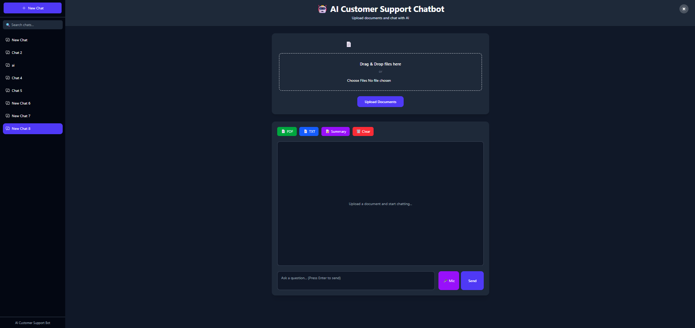
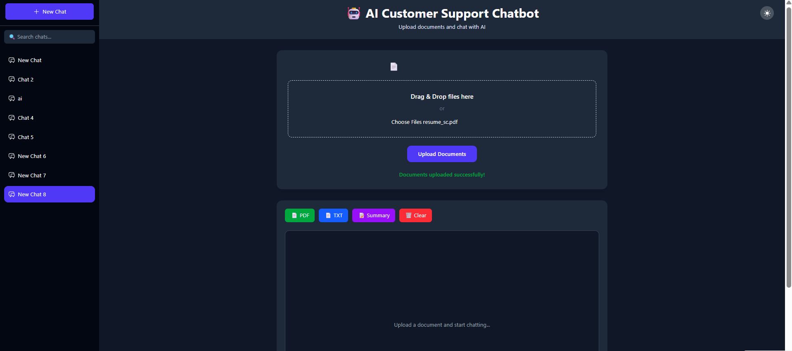
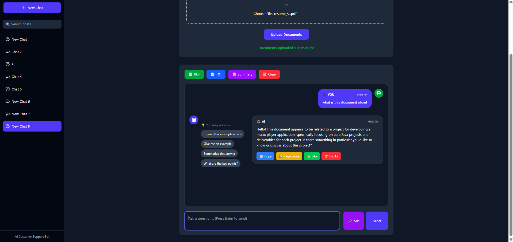

# 🤖 AI Customer Support Chatbot

An AI-powered Customer Support Chatbot built using **React**, **FastAPI**, **LangChain**, **Ollama**, and **ChromaDB**.

The chatbot allows users to upload documents (PDF, DOCX, TXT), ask questions about the uploaded content, and receive intelligent context-aware answers powered by Large Language Models (LLMs).

---

# 🚀 Features

- 📄 Upload PDF, DOCX and TXT documents
- 🤖 AI-powered Question Answering
- 💬 Streaming AI responses
- 🎤 Voice Input
- 🔊 Text-to-Speech
- 💡 Suggested Follow-up Questions
- 📝 Conversation Summary
- 📄 Export Chat as PDF
- 📄 Export Chat as TXT
- 🔍 Search Chats
- 🏷 Chat Tags
- 🌙 Dark Mode
- ⚡ Modern Responsive UI
- 📚 ChromaDB Vector Database
- 🧠 Retrieval Augmented Generation (RAG)

---

# 🛠 Tech Stack

## Frontend

- React.js
- Vite
- Tailwind CSS
- Axios
- jsPDF
- react-speech-recognition

## Backend

- FastAPI
- LangChain
- Ollama
- ChromaDB
- Python

---

# 🏗 Architecture

```
            User
              │
              ▼
        React Frontend
              │
              ▼
         FastAPI Backend
              │
      ┌───────┴────────┐
      ▼                ▼
 Document Upload   User Question
      │                │
      ▼                ▼
 Embedding Generation
      │
      ▼
 Chroma Vector Store
      │
      ▼
 Relevant Context Retrieval
      │
      ▼
      Ollama LLM
      │
      ▼
 AI Response
```

---

# 📸 Screenshots

## 🏠 Home Page



---

## 📄 Document Upload



---

## 💬 Chat Interface



---

# ⚙ Installation

## Clone Repository

```bash
git clone https://github.com/saicharithaamarneni/AI-Customer-Support-Chatbot.git
```

---

## Backend

```bash
cd backend

python -m venv venv

venv\Scripts\activate

pip install -r requirements.txt

python app.py
```

---

## Frontend

```bash
cd frontend

npm install

npm run dev
```

---

# 📂 Project Structure

AI-Customer-Support-Chatbot

├── backend
│   ├── app.py
│   ├── chatbot.py
│   ├── embeddings.py
│   ├── upload.py
│   ├── vector_store.py
│   └── requirements.txt
│
├── frontend
│   ├── src
│   ├── public
│   └── package.json
│
└── README.md


---

# 🎯 Future Improvements

- Cloud Database
- User Authentication
- Multi-language Support
- OCR for Scanned PDFs
- Multiple LLM Support
- Docker Deployment

---
## 🌐 Live Demo

Frontend:
https://ai-customer-support-chatbot-black.vercel.app/

> ⚠️ Note:
> This project uses a FastAPI backend with Ollama running locally.
> The deployed frontend demonstrates the UI.
> Full AI functionality requires running the backend locally.

# 👩‍💻 Author

**Sai Charitha Amarneni**

GitHub:
https://github.com/saicharithaamarneni

---

⭐ If you like this project, don't forget to star the repository.